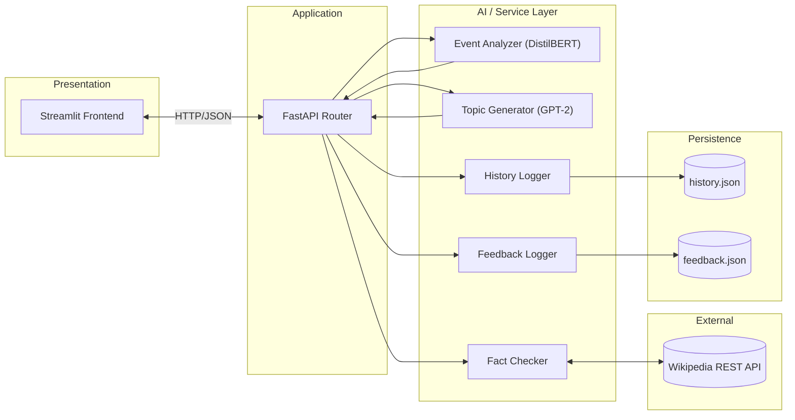
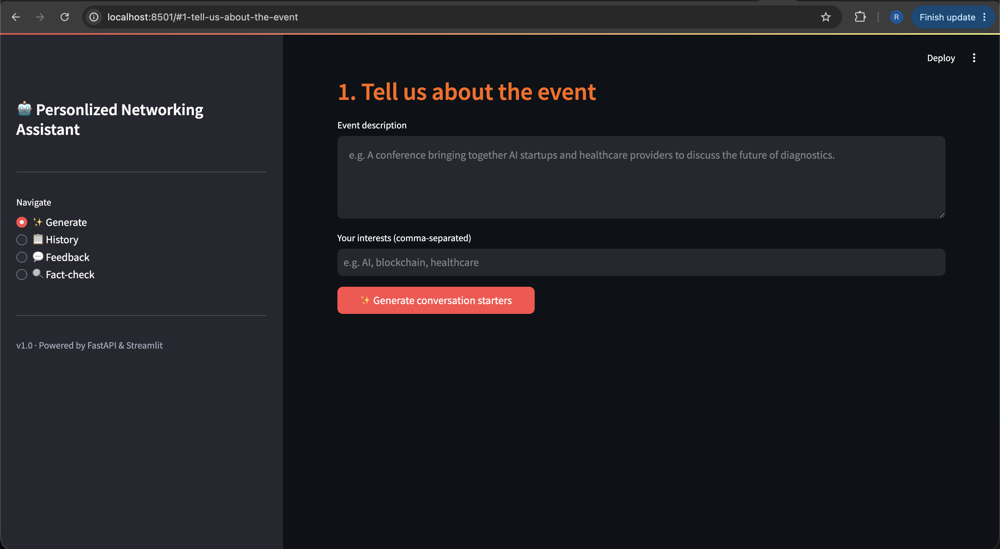
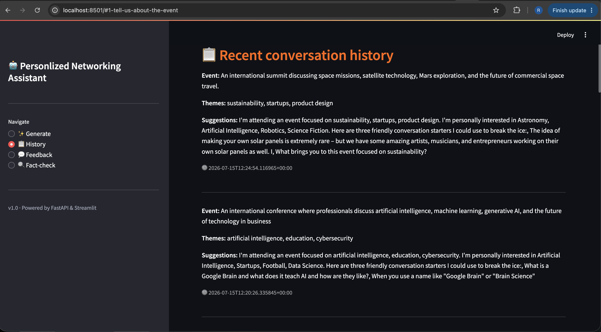
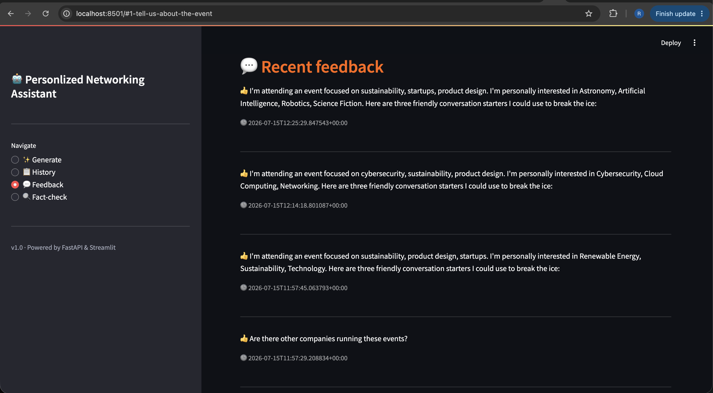
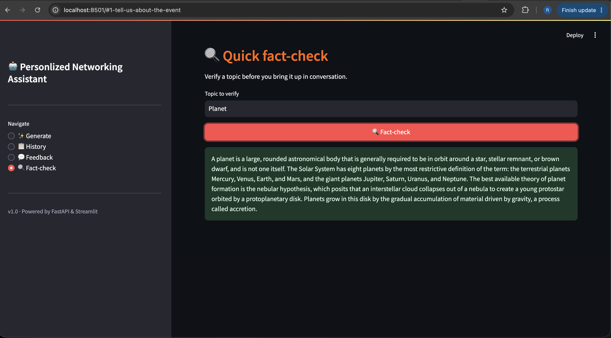
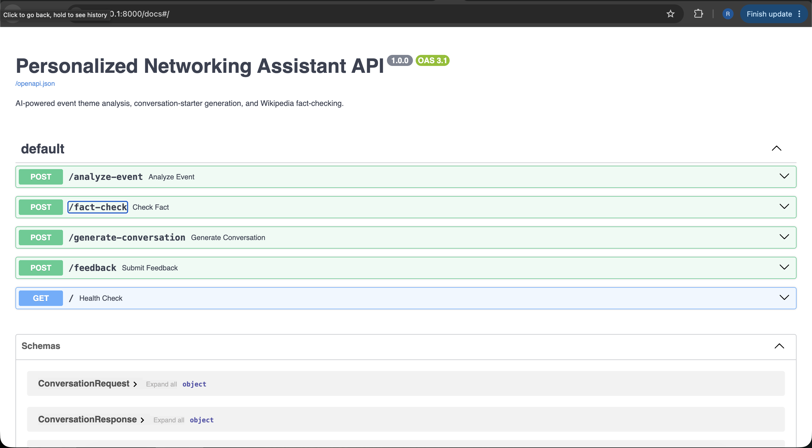

# 🤝 Personalized Networking Assistant

[](https://www.python.org/)
[](https://fastapi.tiangolo.com/)
[](https://streamlit.io/)
[](https://huggingface.co/docs/transformers/)
[](https://docs.pytest.org/)
[](./LICENSE)
[](./.github/workflows/ci.yml)
[](https://github.com/psf/black)

An AI-powered application that helps professionals walk into any networking event with confidence. Give it an **event description** and your **interests**, and it will generate personalized conversation starters, fact-check topics in real time, and keep a history of everything for you.

---

## Table of Contents

- [Overview](#overview)
- [Problem Statement](#problem-statement)
- [Features](#features)
- [Technology Stack](#technology-stack)
- [Architecture](#architecture)
- [Repository Structure](#repository-structure)
- [Installation](#installation)
- [Running the Project in VS Code](#running-the-project-in-vs-code)
- [Running from the Command Line](#running-from-the-command-line)
- [Usage](#usage)
- [API Reference](#api-reference)
- [Testing](#testing)
- [Demo](#demo)
- [Future Scope](#future-scope)
- [Contributors](#contributors)
- [License](#license)

---

## Overview

The **Personalized Networking Assistant** is a full-stack AI application built with **FastAPI**, **Streamlit**, and **Hugging Face Transformers** (DistilBERT + GPT-2). It analyzes an event description to extract key themes, generates natural, personalized conversation starters based on those themes and the user's own interests, verifies facts on demand through Wikipedia, and keeps a persistent, browsable history of every interaction with a lightweight feedback loop.

This repository is organized following an industry-standard **AI/ML project lifecycle structure** — from brainstorming and requirement analysis through design, planning, development, testing, and demonstration — in addition to containing the complete, runnable source code.

## Problem Statement

> Professionals attending networking events frequently struggle to initiate confident, relevant, and factually accurate conversations due to a lack of quick contextual preparation, verification tools, and structured follow-up — resulting in missed relationship-building opportunities and unnecessary social anxiety.

See `1. Brainstorming & Ideation/Define Problem Statements.md` for the full problem statement canvas and persona-level breakdown.

## Features

| # | Feature | Description |
|---|---|---|
| 1 | 🧠 Event Theme Analysis | Zero-shot classification (DistilBERT) extracts the top 3 themes from any free-text event description |
| 2 | 💬 Personalized Conversation Starters | GPT-2 generates 3 natural conversation starters combining event themes and personal interests |
| 3 | 📚 Wikipedia Fact-Checking | Instantly verify any topic via the Wikipedia REST API, with graceful fallback on failure |
| 4 | 🗂️ Conversation History | Every generated conversation is automatically logged and browsable in the UI |
| 5 | 👍👎 Feedback Collection | Rate individual suggestions to build a foundation for future personalization |
| 6 | 📄 Auto-Generated API Docs | Interactive Swagger UI for every endpoint, generated automatically by FastAPI |
| 7 | ✅ Automatic Request Validation | Pydantic-powered validation returns clear `422` errors on malformed input |
| 8 | 🧪 Full Test Suite | pytest + httpx TestClient covering all services and routes |

## Technology Stack

| Layer | Technology |
|---|---|
| Backend | FastAPI, Uvicorn, Pydantic |
| Frontend | Streamlit |
| AI / ML | Hugging Face Transformers, DistilBERT (zero-shot classification), GPT-2 Small (text generation), PyTorch |
| External API | Wikipedia REST API |
| Persistence | JSON files (`data/history.json`, `data/feedback.json`) |
| Testing | pytest, httpx, pytest-cov |
| DevOps | Docker, GitHub Actions |

Full rationale in `2. Requirement Analysis/Technology Stack.md`.

## Architecture



Full architecture documentation, including sequence and deployment diagrams, is in `3. Project Design Phase/Solution Architecture.md`.

## Repository Structure

```
personalized-networking-assistant/
├── 1. Brainstorming & Ideation
│   ├── Brainstorming & Idea Prioritization.pdf
│   ├── Define Problem Statements.pdf
│   └── Empathy Map.pdf
│
├── 2. Requirement Analysis
│   ├── Customer Journey Map.pdf
│   ├── Data Flow Diagram.pdf
│   ├── Solution Requirements.pdf
│   └── Technology Stack.pdf
│
├── 3. Project Design Phase
│   ├── Problem-Solution Fit.pdf
│   ├── Proposed Solution.pdf
│   └── Solution Architecture.pdf
│
├── 4. Project Planning Phase
│   └── Project Planning.pdf
│
├── 5. Project Development Phase
│   ├── Code-Layout, Readability and Reusability.pdf
│   ├── Coding & Solution.pdf
│   └── No. of Functional Features Included in the Solution.pdf
│
├── 6.Project Testing
│   └── Performance Testing.pdf
│
├── 7.Project Documentation
│   ├── Project Executable Files.pdf
│   └── Sample Project Documentation.pdf
│
├── 8.Project Demonstration
│   ├── Communication.pdf
│   ├── Demonstration of Proposed Features.pdf
│   ├── Project Demo Planning.pdf
│   ├── Scalability & Future Plan.pdf
│   └── Team Involvement in Demonstration.pdf
│
├── 9.Programmes and codes
│   ├── app
│   │   ├── models
│   │   │   ├── __init__.py
│   │   │   └── schemas.py
│   │   │
│   │   ├── routes
│   │   │   ├── __init__.py
│   │   │   └── conversation.py
│   │   │
│   │   ├── services
│   │   │   ├── __init__.py
│   │   │   ├── event_analyzer.py
│   │   │   ├── fact_checker.py
│   │   │   ├── feedback_logger.py
│   │   │   ├── history_logger.py
│   │   │   └── topic_generator.py
│   │   │
│   │   ├── __init__.py
│   │   └── main.py
│   │
│   ├── data
│   │   ├── .gitkeep
│   │   ├── feedback.json
│   │   └── history.json
│   │
│   ├── docs
│   │   └── ER_DIAGRAM.md
│   │
│   ├── frontend
│   │   └── streamlit_app.py
│   │
│   ├── tests
│   │   ├── __init__.py
│   │   ├── test_event_analyzer.py
│   │   ├── test_fact_checker.py
│   │   ├── test_routes.py
│   │   └── test_topic_generator.py
│   │
│   ├── Dockerfile
│   ├── README.md
│   └── requirements.txt
│
├── 10.Screenshots
│   ├── 1_Swagger_UI.png
│   ├── 2_Homepage.png
│   ├── 3_History.png
│   ├── 4_Feedback.png
│   └── 5_Fact_Check.png
│
├── Video
│   └── DEMOvideo.md
│
└── LICENSE
```

---

## Installation

### Prerequisites

- [Python 3.11+](https://www.python.org/downloads/)
- [Git](https://git-scm.com/doc)
- [Visual Studio Code](https://code.visualstudio.com/) (recommended editor)

### Clone & Set Up

```bash
git clone https://github.com/<your-username>/personalized-networking-assistant.git
cd personalized-networking-assistant

python -m venv venv

# macOS / Linux
source venv/bin/activate
# Windows
venv\Scripts\activate

pip install -r requirements.txt
```

> ⏳ First run downloads DistilBERT and GPT-2 model weights from Hugging Face (a few hundred MB, one-time only).

---

## Running the Project in VS Code

Follow these steps to open, configure, and run the entire project inside **Visual Studio Code**.

### 1. Open the Project
- Launch VS Code → **File → Open Folder…** → select the `personalized-networking-assistant` folder.

### 2. Install Recommended Extensions
- **Python** (Microsoft) — IntelliSense, linting, debugging
- **Pylance** — fast type checking
- (Optional) **Docker** — if you plan to use the provided `Dockerfile`

### 3. Select the Python Interpreter
- Open the Command Palette: `Ctrl+Shift+P` (Windows/Linux) or `Cmd+Shift+P` (macOS)
- Type **"Python: Select Interpreter"**
- Choose the interpreter inside `venv` (e.g. `./venv/bin/python` or `.\venv\Scripts\python.exe`)

> If you haven't created the virtual environment yet, open a VS Code terminal (`` Ctrl+` ``) and run the commands from [Installation](#installation) above first.

### 4. Install Dependencies (inside VS Code's integrated terminal)
```bash
pip install -r requirements.txt
```

### 5. Run the Backend (FastAPI)
Open a VS Code terminal (`` Ctrl+` ``) and run:
```bash
uvicorn app.main:app --reload
```
Leave this terminal running. Visit `http://127.0.0.1:8000/docs` to confirm it's live.

### 6. Run the Frontend (Streamlit)
Open a **second** VS Code terminal (click the `+` icon in the terminal panel to split) and run:
```bash
streamlit run frontend/app.py
```
Visit `http://localhost:8501` — this opens automatically in your default browser.

### 7. (Optional) Debugging in VS Code
Create a `.vscode/launch.json` for one-click debugging of the backend:
```json
{
  "version": "0.2.0",
  "configurations": [
    {
      "name": "FastAPI: Uvicorn",
      "type": "debugpy",
      "request": "launch",
      "module": "uvicorn",
      "args": ["app.main:app", "--reload"],
      "jinja": true
    }
  ]
}
```
Then use the **Run and Debug** panel (`Ctrl+Shift+D`) → select **"FastAPI: Uvicorn"** → press **F5**.

### 8. Running Tests in VS Code
- Open the **Testing** panel (flask icon in the sidebar) → **Configure Python Tests** → select **pytest** → select the `tests` folder.
- Run all tests from the Testing panel, or from the terminal:
```bash
pytest -v --cov=app tests/
```

---

## Running from the Command Line

If you prefer not to use VS Code's UI, everything above can be done purely from any terminal:

```bash
# Terminal 1
uvicorn app.main:app --reload

# Terminal 2
streamlit run frontend/app.py
```

- Streamlit UI: http://localhost:8501
- FastAPI Swagger docs: http://127.0.0.1:8000/docs

---

## Usage

1. Open the Streamlit UI.
2. Enter an **event description** (e.g. "A fintech and blockchain innovation summit").
3. Enter your **interests**, comma-separated (e.g. `blockchain, product design`).
4. Click **"✨ Generate conversation starters"** to receive 3 personalized suggestions.
5. Use the **fact-check panel** to verify any topic before bringing it up.
6. Rate suggestions with 👍/👎 — this is saved to your feedback history.
7. Scroll down to review your **conversation history** and **feedback history**.

## API Reference

| Method | Endpoint | Description |
|---|---|---|
| `GET` | `/` | Health check |
| `POST` | `/analyze-event` | Extract themes from an event description |
| `POST` | `/fact-check` | Verify a topic via Wikipedia |
| `POST` | `/generate-conversation` | Full pipeline: themes → suggestions → auto-logged history |
| `POST` | `/feedback` | Submit a like/dislike rating for a suggestion |

Full request/response examples are documented inline in the FastAPI Swagger UI (`/docs`) and in `5. Project Development Phase/Coding & Solution.md`.

## Testing

```bash
pytest -v --cov=app tests/
```

Covers all four service modules (structural + mocked-network tests) and full route-level integration tests, including the `422` validation path. See `6. Project Testing/Performance Testing.md` for coverage targets and load-testing guidance.

## 📸 Application Screenshots

### 🏠 Homepage


### 💬 Generated Conversation Starters


### 📜 Conversation History


### 👍 Feedback Page


### 🔍 Fact Check


### 📚 Swagger API Documentation


---

## 🎥 Demo Video

Watch the complete end-to-end demonstration of the Personalized Networking Assistant here:

[▶️ Watch Demo Video](https://drive.google.com/file/d/1VvqjElYaf1wUsaNw_CeV_0N4svdEpRIV/view?usp=sharing)
## Future Scope

- Migrate JSON storage to a relational database (schema documented in `docs/ER_DIAGRAM.md`)
- User authentication and persistent multi-user profiles
- Multilingual conversation generation
- Speech-based (voice) interaction
- Feedback-driven recommendation/re-ranking loop
- Cloud deployment with Docker + CI/CD (workflow already scaffolded in `.github/workflows/ci.yml`)

Full roadmap in `8. Project Demonstration/Scalability & Future Plan.md`.

## Contributors

| Name | Contributions |
|---|---|
| **Nanditha Sai Munagapati** | Environment setup, Topic Generator service, History Logger service, Routing architecture, Frontend setup & state management |
| **Raj Singh Mall** | Model research & selection, Fact Checker service, API routes, Service layer design, Testing |
| **Karuna Naga Venkata Kavya Sree Gudiwada** | Application architecture, Event Analyzer service, FastAPI feature integration, Feedback Logger service, Results/Feedback UI |
| **Kadiyam Udayasri** | Documentation, UI enhancements, Integration support, Testing assistance, Project coordination |

## License

## 📁 Video
Contains project demonstration information.

## 📄 LICENSE
Contains licensing information for the project.
